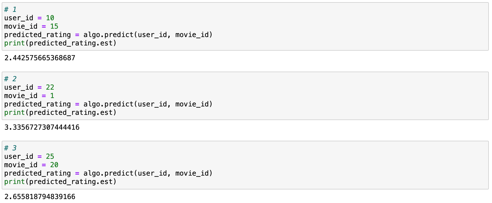
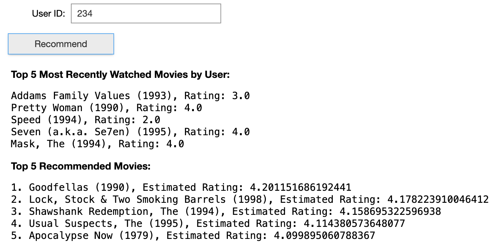
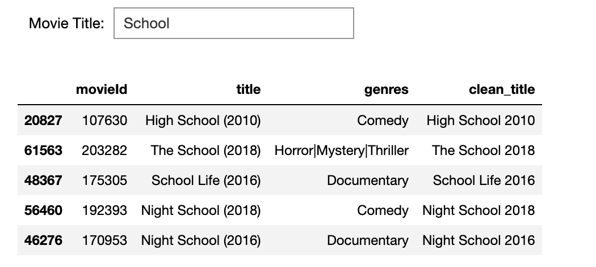
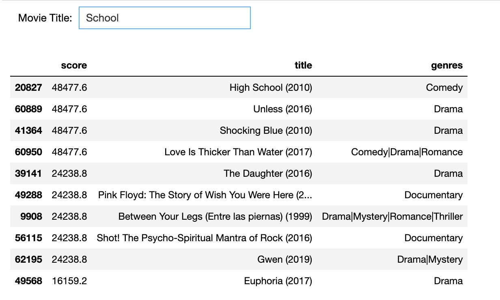
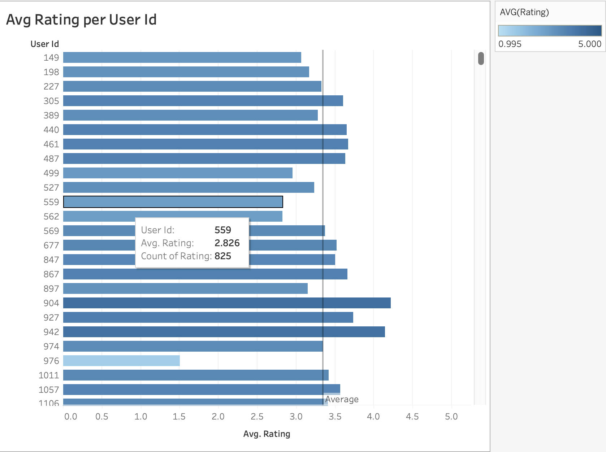
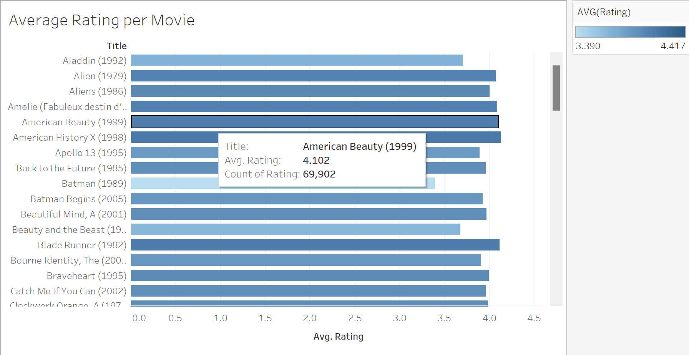
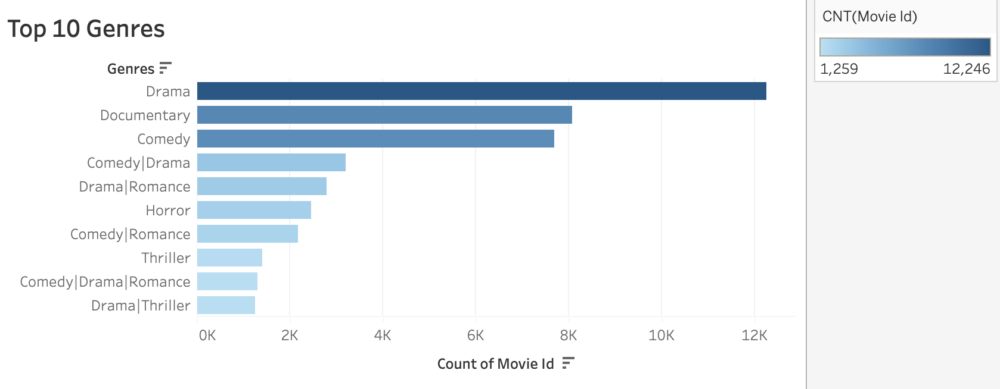

# Movie Recommendation System

## Collaborators: 
- [Dalya Lami](https://github.com/DalyaLami)
- [Ali Alam](https://github.com/AliAlam1998)
- [Jahn Ferdinandus](https://github.com/jahnferdinandus)
- [Dayana Imanova](https://github.com/DayanaIm)

## Table of Contents

- [About](#about)
- [Getting Started](#getting-started)
- [Installing](#installing)
- [Analysis](#analysis)
- [References](#references)

## About
We are focused on developing a movie recommendation model that incorporates user ratings to provide personalized recommendations. The project involves exploring and analyzing 
a dataset of user ratings and movie information, Which will allow us to better understand individual preferences and provide tailored recommendations that align with each user's 
unique taste and interests. As a bonus we also utilized a content and collaborative based filtering to recommend new movies based on the movie of your choice.

### Breakdown of what the SVD model does
User Input Retrieva & Filtering:
* Retrieves the user ID for whom recommendations are to be generated
* Filters out movies that the user has already rated, preparing a list of potential recommendations.

Generate Movie Recommendations:
* It employs a collaborative filtering algorithm, utilizing the Surprise library, to predict ratings for unrated movies for the specified user.
* Predicts the user's ratings for each unrated movie, and a list of tuples containing movie IDs and their estimated ratings is created.
* It sorts and displays the top 5 recommended movies, including their titles and estimated ratings.

## Getting started

### Prerequisites
Before you begin, ensure you have the following installed:
- Python 3.x
- Required Python packages (pandas, numpy, Surprise, sklearn, ipywidgets)

## Installing

Install the necessary packages and download the files from [GroupLens](https://grouplens.org/datasets/movielens/latest/) called **ml-latest.zip**. Extract the files and place all csv files inside a **MovieLens-resources** folder on your desktop. 

## Result and Analysis Screenshots

### SVD model - Score Prediction

### SVD model - Top 5 movies that the user will most likely enjoy

### Content based reccomendation using movie title

By entering a movie title, the system utilizes content-based filtering to recommend movies based on similar titles.

### Colaborative based reccomendation using movie title and ratings

By entering a movie title and leveraging collaborative filtering, the system utilizes ratings to assign an overall score and provides quick suggestions for additional movies we might like.

### Average Rating per User ID

This image shows each user with their avg rating total for all the movies, while also showing the total number of movies they’ve rated. The vertical line shows the average total for all the user ratings

### Average Movie Rating

This image shows each movie with it’s avg rating total, while also showing the total number of users that have rated the movie. 

### Top Ten Genres

  
## References
 - Dataset used [GroupLens](https://grouplens.org/datasets/movielens/latest/)
 - Reference Video on [YouTube](https://grouplens.org/datasets/movielens/latest/)
